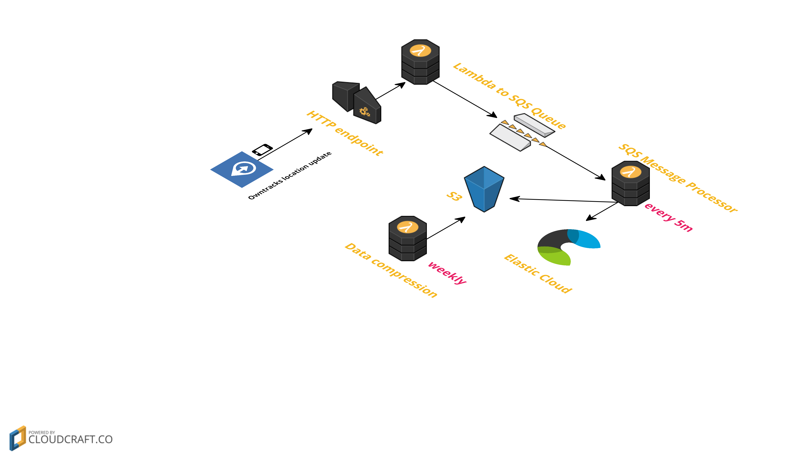
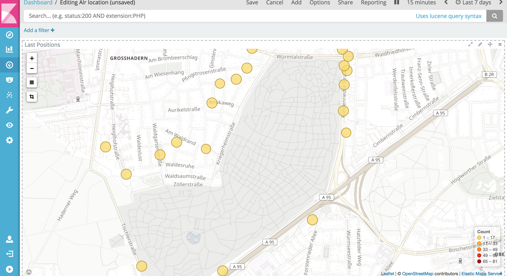

# serverless-owntracks-kotlin - Take control of your location data

This little gem uses AWS Lambda and the [serverless framework](https://serverless.com/) to store your location data in an S3 bucket. Optionally you can send the data to an Elasticsearch cluster as well. The code is written in kotlin and thus needs the JVM to run. In order to get the data from your phone, we are using the [owntracks App](http://owntracks.org/), an open source location tracker.

Location data is pretty sensitive data. I dont want it to leak to third parties, when I enabling it on my phone and send it somewhere to a company that is selling it (yes, I know the cell phone provider obviously has this data). [Owntracks](http://owntracks.org/) is a neat app that tracks your location and sends it to an MQTT broker by default. I however have gotten rid of any server system thanks to static site generators and I did not want to rent or maintain another server.

This project consists of three AWS lambdas

* The first one is a HTTP function, accepts incoming data (given successful HTTP Basic Auth) and writes it off to an SQS queue
* The second reads from that queue and processes each event through a list of processors. The only current implementations are one processor writing to S3 and another one sending data to an Elasticsearch instance
* The third lambda runs weekly and reduces the data in S3 to a single gzipped file

Here is a small diagram




## Requirements

* node.js/npm
* the serverless framework, can be installed via `npm -g install serverless`
* A JDK, java 8 and above

## Getting up and running

Getting up and running only involves very few steps after cloning the repo. Mainly you need to add a file containing your configuration and then you need to deploy. So let's get started.

### Configure via `.env.yml`

Create a file named `.env.yml` in the cloned repository (no worries, it is in `.gitignore`). It should look like this

```
# The basic authentication string to use for the lambda basic authentication
# Do something like this on the command line: echo user:password | base64
BASIC_AUTH: dXNlcjpwYXNzd29yZAo=

# host to connect to remote elasticsearch cluster
# be sure to include the scheme (http or https) and the port
#
ELASTIC_MESSAGE_PROCESSOR_HOST: https://CLOUD_ID.us-east-1.aws.found.io:9243

# basic auth to use for the remote elasticsearch cluster
# same as above, if you have an elasticsearch cluster to write to
ELASTIC_MESSAGE_PROCESSOR_AUTH: dXNlcjpwYXNzd29yZAo=

# the bucket to use
AWS_BUCKET: my-personal-owntracks-bucket

# the SQS queue to use
AWS_QUEUE: owntracks-queue
```

That's it, let's deploy

### Deploy

Run 

```
./gradlew clean check assemble && sls deploy
```

The above command downloads all the dependencies, runs the tests and if that was successful will deploy the package into AWS. This might take a few minutes and you can run `sls info` after that to see the deployed functions and the endpoint URL.

### Check if lambda works

Run `sls logs -f http --startTime '1m' -t` in one terminal and execute a curl request like this in another (replacing user/pass with the configured one and the correct endpoint)

```
curl -u user:pass -X POST https://YOUR_ID.execute-api.us-east-1.amazonaws.com/dev/location -d '{
  "tst": 1501357392,
  "lon": 12.9906219,
  "lat": 42.6584058
}'
```

You should see the HTTP request happening without any exceptions.

### Optionally: Start an Elasticsearch cluster

If you want to index your data into an elasticsearch cluster, you need to add the included index template to make sure that latitude and longitude are correctly indexed as a geo point. You can do this by putting the template like this

```
curl -u user:pass -X PUT 'https://YOUR_ES_CLUSTER:9243/_template/owntracks' -v -d@index-template.json
```

If you dont want to use an Elasticsearch cluster, just comment the lines out in the `.env.yaml` file.

With ES up and running it is easy to create a dashboard like this



### Install app on phone

Now install the owntracks app in your phone and configure the correct HTTP endpoint with the correct credentials. After you are done, you can again run `sls logs -f http --startTime '1m' -t` and trigger an location update by clicking the top right icon in the map. It should show up and from then on your location will be tracked.

## Further reading

I have written a [lengthy blog post about this project](), if you want to know more.

# FAQ

## Your code does not look like Kotlin.

Yes. This are my first tries with it. Feel free to kotlinize it and send in PRs. Especially testing with mocking needs to be improved to make the implementation less test driven.

## Why havent you written this in JavaScript/TypeScript/Cobol? It would be so much cheaper.

Yes. Feel free to rewrite it, but dont drag me into religious discussions.

## I am missing processor doing `X`

Yes. Feel free to fork and add it. You can also create PRs if you do not drag in new dependencies or if you manage to change the build to include only the required dependencies. I do not want this to bloat, if possible.
